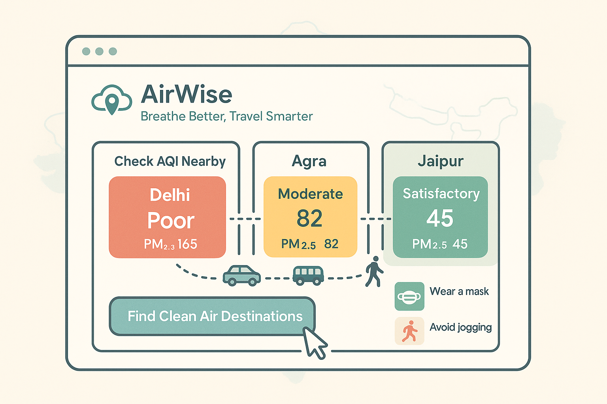

Recently, the AQI levels in Delhi and its surrounding areas have been making headlines for all the wrong reasons.&nbsp;With air pollution worsening and people scrambling for data to understand their local air quality, I decided to build this fun little project&nbsp;
# AirWise – Breathe Better, Travel Smarter. 




[](https://chatgpt.com/c/LICENSE)
[](https://nodejs.org/)
[](https://www.mongodb.com/)
AirWise is a web application that helps users find nearby locations with better air quality (AQI) for short trips or vacations. Built with React, Node.js, and MongoDB, the platform offers real-time AQI data and travel recommendations based on air quality.

## Features ✨

Real-Time AQI Data: Fetches live AQI data using the WAQI API.
Curated Low-AQI Destinations: Database of pre-vetted locations with consistently good air quality.
Geospatial Search: Finds nearby low-AQI locations within a specified radius.
Historical AQI Trends: Displays past AQI data for informed decision-making.
Health Recommendations: Provides health tips based on AQI levels.
Travel Assistance: Includes transport options, accommodation suggestions, and points of interest.


## Tech Stack 🛠️

- Frontend: React, TailwindCSS
- Backend: Node.js, Express, MongoDB ,Redis
- APIs: WAQI API, Google Maps API
- Deployment: Docker, AWS


## Installation 🚀
### Prerequisites

Node.js (v16 or higher) 
MongoDB (v5 or higher)
WAQI API Token
Redis (v6 or higher)

## User WorkFlow  


### Steps


Clone the repository:
```
git clone https://github.com/your-username/aqi-trip-planner.git
cd aqi-trip-planner
```


Install dependencies:
```
cd backend &amp;&amp; npm install
cd ../frontend &amp;&amp; npm install
```


Set up environment variables:
Create a .env file in the backend folder:
MONGO_URI=```mongodb://localhost:27017/aqi-places```
WAQI_API_KEY=```your_waqi_api_key```
PORT=5000


``` 
Start the backend server:
cd backend &amp;&amp; npm start
```


Start the frontend development server:
```cd frontend &amp;&amp; npm start```


## API Endpoints 📡
### Places

GET /api/places - Retrieve all locations.
GET /api/places/nearby?lat=&lt;latitude&gt;&amp;lon=&lt;longitude&gt;&amp;radius=&lt;radius&gt; - Get nearby locations within a radius (in km).


## Usage 🌿

Search for a city or station to get real-time AQI data.
View pollutant levels, health implications, and historical trends.
Get travel recommendations for cleaner air destinations.
Access transport routes, accommodation suggestions, and local attractions.
Receive health and activity guidance based on AQI levels.


## License 📜
This project is licensed under the MIT License. See the [LICENSE](https://chatgpt.com/c/LICENSE) file for more details.
